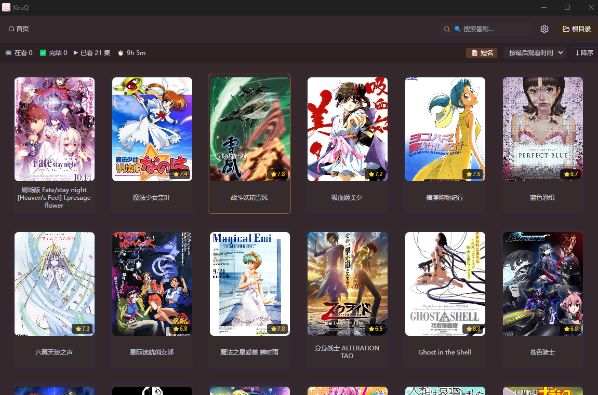
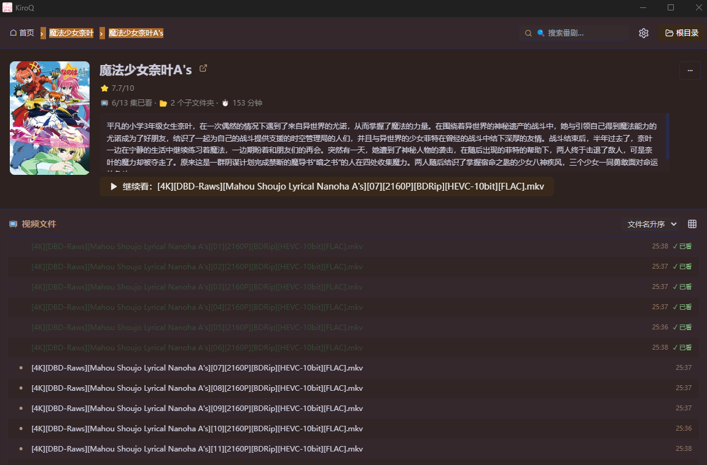

# KiroQ v2.0

本地动漫观看进度管理工具。浏览番剧文件夹、标记已看集数、自动获取番剧信息。

## 技术栈

Electron + TypeScript + React + Zustand + Tailwind CSS + Framer Motion

## 快速开始

解压后双击 `KiroQ.exe` 即可启动。

## 截图

| 主页 | 详情页 |
|------|--------|
|  |  |

## 功能

- 番剧文件夹宫格浏览，自适应列数 + 补位动画
- 进入文件夹查看视频列表/宫格，标记已看/未看
- 右键菜单：置顶、隐藏、打开文件夹位置、删除、多选批量操作
- 外部播放器启动 + PotPlayer 播放进度自动记录
- 视频时长扫描（ffprobe）+ 缩略图生成（ffmpeg）
- 数据来源管理，支持自定义 API（Bangumi / Jikan / 其他）
- 15 套主题（暗色/亮色 × 8 色 + 跟随系统）
- 导航面包屑、搜索、排序、短名/原名切换
- 主页滚动位置记忆、窗口位置记忆、禁止重复启动

## 开发

```bash
npm install        # 安装依赖
setup.bat          # 下载 ffmpeg
npm run dev        # 开发模式
npm run build      # 构建
```

## 旧版

v1.1 (Python/customtkinter) 在 `v1/` 目录，只读保留。

## 数据存储

- `%APPDATA%/KiroQ/kiroq-data.json` — 观看记录、元数据
- `%APPDATA%/KiroQ/window-state.json` — 窗口位置大小
- `%APPDATA%/KiroQ/thumbnails/` — 视频缩略图缓存
- `%USERPROFILE%/.kiroq_data.json` — 旧版 v1.1 数据（自动迁移）

## 免责声明

本软件按"原样"提供，不提供任何明示或暗示的担保。使用本软件即表示您同意：

- **数据风险**：数据存储在本地 JSON 文件，建议定期备份。开发者对任何数据丢失或损坏不承担责任。
- **外部服务**：数据抓取依赖第三方 API（如 Bangumi），可用性由服务提供方决定，与开发者无关。
- **版权声明**：本软件仅管理本地文件，不提供、不存储、不分发任何受版权保护的内容。用户对自己硬盘上的文件负责。
- **使用限制**：仅供个人学习和研究使用。

## 许可

MIT
